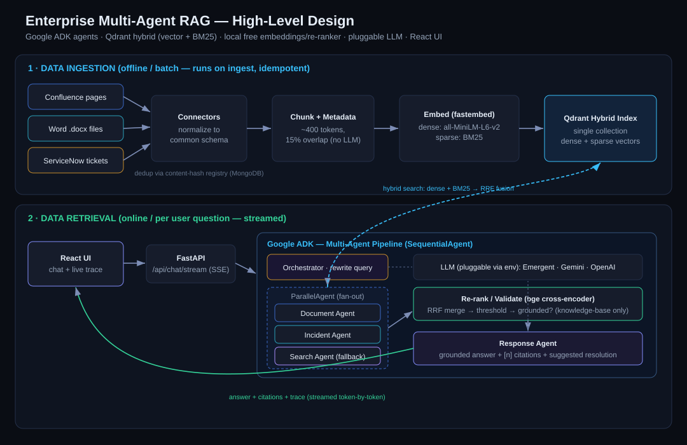

# 🧠 Enterprise Multi-Agent RAG — "RAG Command Center"

Ask questions in plain English and get **answers grounded in your own company knowledge** — Confluence pages, Word documents, and past ServiceNow tickets — each with **citations** and a **suggested resolution**. Every answer shows a live **agent trace** so you can see exactly how it was produced.

Built with **Google ADK** (multi-agent orchestration) + **Qdrant** hybrid search, using **free/open-source** embedding & re-ranking models. The chat answer streams token-by-token, supports **dark/light mode**, and can be **stopped mid-answer**.

---

## 🖼️ How it works (High-Level Design)



**In one line:** documents are chunked and stored once in a hybrid index (offline); each question fans out to specialist agents that search that index, the best evidence is re-ranked and validated, and a final agent writes a grounded, cited answer (online).

**① Ingestion (offline):** `Connectors → normalize → chunk (~400 tok) → embed (MiniLM dense + BM25 sparse) → Qdrant`. Re-running is safe — unchanged docs are skipped via a content-hash registry.

**② Retrieval (online):** `Question → Orchestrator (rewrites query) → Parallel [Document · Incident · Search] agents → hybrid search (dense+BM25, RRF) → Re-rank/Validate (cross-encoder) → Response (grounded answer + citations)`.

**🔒 Knowledge-base-only:** if nothing relevant is found, the assistant refuses instead of guessing — it never answers from general knowledge (e.g. "what's today's date?" is declined).

---

## 🚀 Start using it (in the running preview)

It's already live. Just open the app and:
1. Type a question, or tap a **sample query** chip.
2. Watch the **Agent Trace** panel light up on the right as each agent runs.
3. Read the streamed answer, open the **citations**, and toggle **dark/light** (top-right sun/moon).

Try: *"How do I fix GlobalProtect 'Portal unreachable' on home WiFi?"* or *"A pod is stuck in CrashLoopBackOff — has this happened before?"*

### Run locally
```bash
# Backend
cd backend && python -m venv .venv && source .venv/bin/activate
pip install -r requirements.txt
cp .env.example .env                     # fill in keys (see below)
python -m ingestion.run --source all     # index the (mock) data
uvicorn server:app --port 8001

# Frontend
cd ../frontend && yarn install && yarn start
```

---

## 🔌 Connecting your real data

By default the app uses bundled **mock data** so it runs at $0. To use real systems, set these in `backend/.env` and re-run ingestion:

| Source | What decides *which* data is pulled | Env vars |
|---|---|---|
| **Confluence** | Your base URL + the **space keys** you list | `CONFLUENCE_BASE_URL`, `CONFLUENCE_SPACES` (e.g. `ENG,IT`), `CONFLUENCE_TOKEN` |
| **ServiceNow** | Your instance's incident table, auto-filtered to **closed/resolved** tickets that have a resolution | `SERVICENOW_INSTANCE_URL`, `SERVICENOW_TOKEN` |
| **Word docs** | A **folder** you point to — drop `.docx` files in it | `WORDDOCS_PATH` (else `backend/data/mock/worddocs/`) |

> ⚠️ The live Confluence/ServiceNow fetch is currently **stubbed** (`NotImplementedError`) — the connector interface, filtering, and `.env` wiring are in place; implement the marked live branch in `backend/ingestion/connectors.py` to go live. Word `.docx` parsing is fully working today.

Then: `python -m ingestion.run --source all` (or hit **Re-run Ingestion** on the Ingestion tab).

---

## 🤖 Choosing the AI model (pluggable)

One env switch — no code changes (`backend/agents/model_provider.py`):
```
LLM_PROVIDER=emergent   # emergent | gemini | openai
LLM_MODEL=gpt-5.4
```
- `emergent` → Emergent Universal key (dev/testing, no signup).
- `gemini` → your `GEMINI_API_KEY`.  •  `openai` → your `OPENAI_API_KEY`.

---

## ✨ Features
- Multi-agent pipeline on **Google ADK** (Orchestrator → parallel specialists → re-rank/validate → response).
- **Hybrid retrieval**: dense (MiniLM) + sparse (BM25) fused with RRF, then a `bge-reranker` cross-encoder — all local & free.
- **Grounded answers** with `[n]` citations + a **Suggested Resolution** card for incidents.
- **Knowledge-base-only guardrail** — refuses off-topic / ungrounded questions.
- **Streaming** answers + a **real-time agent trace** (each stage lights up as it runs) with per-tool calls and chunk scores.
- **Dark / light mode**, **source scoping** (Confluence / Word / ServiceNow), **Stop** button, and an **Ingestion dashboard**.

## 🧪 Tests
```bash
cd backend && pytest -q     # connectors, chunking, guardrail, and full grounded-pipeline
```

## 🔗 API
| Method | Path | Purpose |
|---|---|---|
| GET | `/api/status` | index counts, provider/model, sample queries |
| POST | `/api/ingest` | `{source: all\|confluence\|worddocs\|servicenow}` |
| POST | `/api/chat` | grounded answer + citations + trace (non-streaming) |
| POST | `/api/chat/stream` | same, streamed via Server-Sent Events |
| GET | `/api/history/{session_id}` | stored conversation |

## 🗺️ Roadmap
- **Phase 1 (Docker)** and **Phase 2 (Kubernetes: Qdrant StatefulSet, ingestion CronJob, HPA)** deployment.
- Implement the live Confluence/ServiceNow connector branches.
- Answer feedback (👍/👎) for grounding quality.

---
_Tech: React + Tailwind · FastAPI · MongoDB · Qdrant (embedded) · google-adk · litellm · fastembed._
